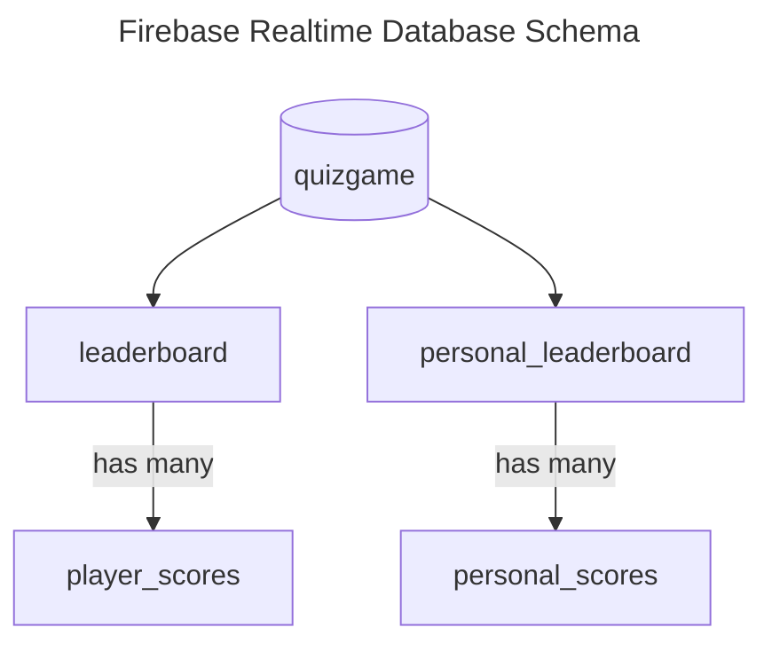

# QuizGame

## Table of Contents

* [General Info](#general-info)
* [Features](#features)
* [Technologies](#technologies)
* [Database Model](#database-model)
* [Project Assignment](#project-assignment)
* [Getting Started](#getting-started)
* [Credits](#credits)

## General Info

A knowledge quiz game Android app developed in Java. 🤔🧠❓

> Project created as a final project for university subject:  
> *DPR001 - Mobile Technologies*  
> *University of Split - University Department of Professional Studies*


## Features

- User authentication (Firebase Authentication service - email and password authentication)
    - Registration
    - Login
    - Logout
- Game logic
    - Timer
        - Countdown timer (60 seconds)
        - Ending the game when the timer reaches zero
    - Scoring
        - Awarding points (+100) for correct answers
        - Penalizing points (-100) for incorrect answers (if the user has any points)
    - Question and answer handling
        - Retrieving questions from an API (Open Trivia Database) using Retrofit
        - Displaying questions and answers
        - Handling user's answer selection
- Saving results to Firebase Realtime Database
- Leaderboard
    - Displaying top 10 results among all players
- Personal leaderboard
    - Displaying all of the user's previous results arranged from recent to oldest
    - Displaying all of the user's previous results arranged from highest to lowest score
- Handling game interruptions
    - Saving the game state when the user receives a call
    - Restoring the game state when the user returns to the app after the call
- Animations
    - "Celebratory" animation when the user sets a new personal best score

## Technologies


## Database Model



For example, the database could look like this:
```
quizgame
  |_ leaderboard
  |   |_ johndoe: 1500
  |   |_ janedoe: 1900
  |_ personal_leaderboard
      |_ johndoe:
      |   |_ 1706131648510: 1300
      |   |_ 1706132545905: 1500
      |   |_ 1706134089855: 800
      |   |_ 1706283706395: 0
      |_ janedoe
          |_ 1706280830140: 500
          |_ 1706282857804: 1900
          |_ 1706283278266: 600
```

To explain the structure further:
- `quizgame`: The root node of the database.
  - `leaderboard`: Branch storing scores for all players in the game.
    - `username`: A player's entry with their high-score.
  - `personal_leaderboard`: Branch storing personalized scores for players.
    - `username`: Sub-branch for `username`'s personalized scores.
      - `timestamp`: Specific score entries with associated timestamps.

## Project Assignment

Create a game called "Knowledge Quiz" (the quiz topic is arbitrary). In order for the user to be able to play the game, they must be authenticated (Firebase). After successful login, authenticated users are redirected to the option to start the game. The user can play the game any number of times and has access to the results they have saved. If the user receives a call while playing the game, upon ending or rejecting the call, the user is returned to the screen where they left off, and their result remains saved, allowing them to continue the quiz uninterrupted.

### Additional Features

1. The knowledge quiz game awards points and seconds. Each correct answer rewards the player with additional points and/or seconds, while incorrect answers are penalized. Seconds count down as the user plays, and the game ends when the seconds reach zero.
2. A successful result is "celebrated" with an activity featuring a "celebratory animation."
3. Create a list of the top 10 results collected among all players.

### Seminar Defense Practical Task

1. After the user successfully logs in, in addition to opening the option to play a new game, there is also an option to view all of the user's previously saved results arranged from highest to lowest. The results are obtained by clicking a button and displayed on a new Activity in a RecyclerView.
2. At the end of each played game, when saving the results, the user is shown their position relative to all saved results in the database. For example, it says "This is the fifth best result so far."

## Getting Started

### Prerequisites

- Android Studio
- Android SDK
- Emulator or physical device
- Firebase project (Google account required) with the following services enabled:
    - Firebase Authentication
    - Firebase Realtime Database

### Running the Project

1. Clone the repository
    ```bash
    git clone git@github.com:anamarijapapic/QuizGame.git
    ```
2. Open the project in Android Studio
3. Connect the project to your Firebase project
    - Download the `google-services.json` file from your Firebase project
    - Move your downloaded `google-services.json` file into your module (app-level) root directory
3. Run the project on an emulator or a physical device

## Credits

- [Anamarija Papić](https://github.com/anamarijapapic)
